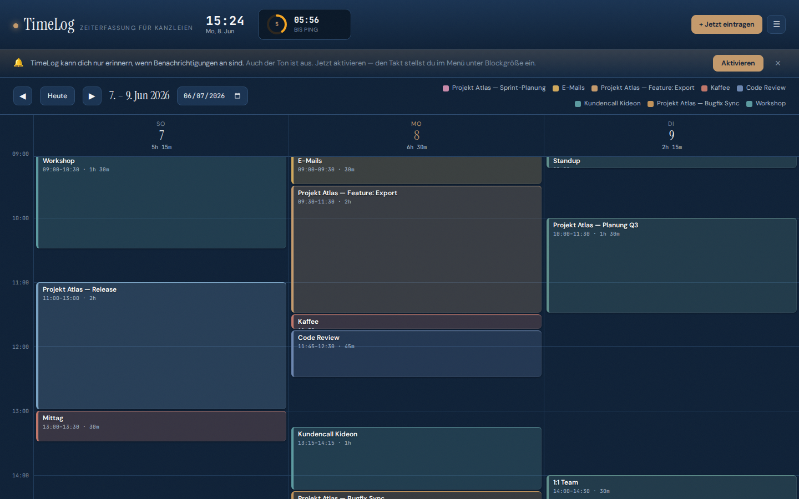
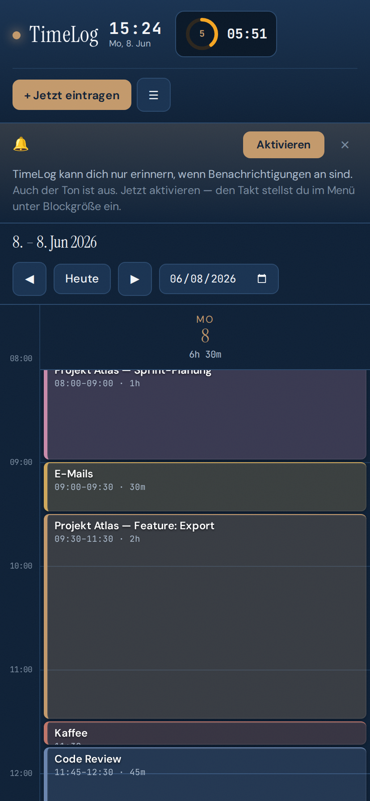
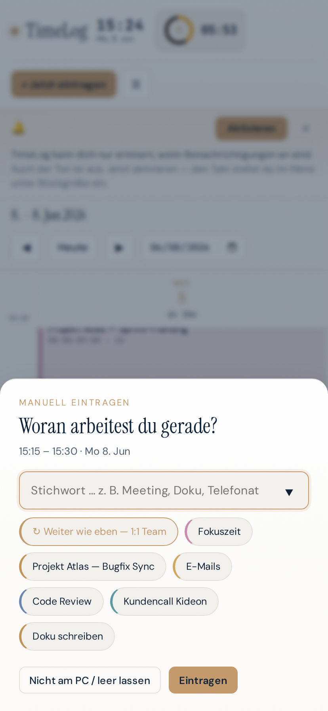
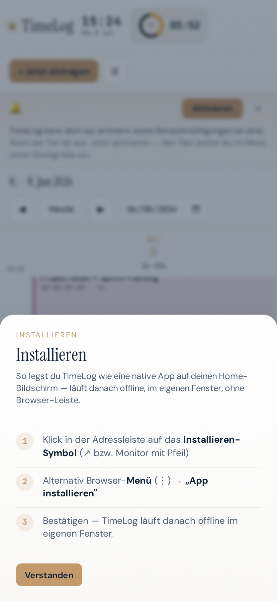
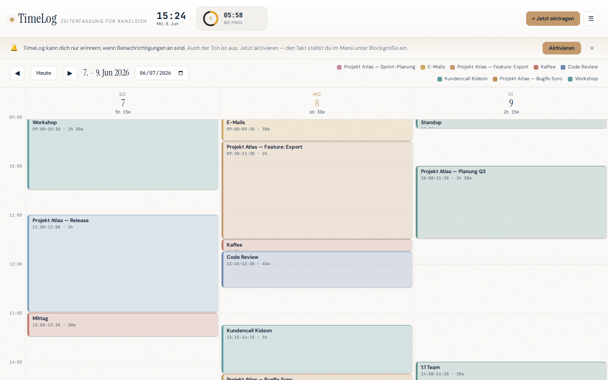

# TimeLog

**Zeiterfassung für Kanzleien.** · **DSGVO-konform · Für Kanzleien gemacht · Funktioniert offline**
Live: https://kideon-innovation.github.io/timelogging/

TimeLog ist eine installierbare **Progressive Web App** für die Zeiterfassung in Kanzleien —
Steuer- und Rechtsberatung. Sie fragt dich in festem Takt — *„woran arbeitest du gerade,
für welchen Mandanten?"* — du tippst ein Stichwort, und dein Tag wächst als farbige Blöcke
in einer Kalenderansicht. Am Monatsende exportierst du alles als Excel: fertiger
Stundenzettel, abrechenbar.

**DSGVO-konform durch Bauweise:** kein Backend, kein Login, kein Konto. Alle Daten — auch
Mandantennamen — bleiben lokal im Browser und verlassen das Gerät nie. Das ist zugleich der
Grund, warum die App komplett **offline** läuft.

Das Ping-Intervall ist wählbar: **60, 30, 20, 15, 10 oder 6 Minuten** (Standard 15).
Der Takt ist zugleich die Blockgröße — kürzeres Intervall = feinere Auflösung, mehr Pings.



## Idee

In einer Kanzlei ist jede vergessene Viertelstunde **Honorar, das du nicht abrechnest.**
Manuelle Zeiterfassung zahlt sich nur aus, wenn du sie konsequent mitschreibst — und genau
daran scheitert sie im Alltag. Automatische Tracker wiederum sehen zwar App, Fenster und
Datei, aber nie die *Sache*: welcher Mandant, welches Aktenzeichen weiß nur du. Also
rekonstruierst du es am Monatsende doch wieder aus dem Gedächtnis.

TimeLog dreht das um: **es fragt dich**, in regelmäßigem Takt. Ein Stichwort — Mandant,
Sache, Tätigkeit — und du bist durch. Daraus entsteht ohne Disziplin-Aufwand ein lückenloser,
abrechenbarer Stundenzettel.

**Leere Blöcke sind gewollt.** Nicht getrackt = kein Block. TimeLog drängt dich nie,
Lücken zu füllen; leer lassen ist immer ein Klick. Ein dezenter Heartbeat im Kalender zeigt
dir nebenbei, wann der Rechner überhaupt an war — so siehst du auf einen Blick, welche
Lücken echte Pausen sind und welche noch nachzutragen sind.

## Wie es funktioniert

1. **Öffnen** — als installierte App, `index.html` per Doppelklick oder über GitHub Pages.
   Beim ersten Start fragt es nach Erlaubnis für OS-Benachrichtigungen.
2. **Ping** — im gewählten Takt meldet sich TimeLog (Ton + Popup + optional
   OS-Benachrichtigung). Du tippst ein Stichwort, wählst eine der letzten Tätigkeiten,
   klickst **„Weiter wie eben"** oder lässt leer. Das Intervall stellst du oben im
   Header um.
3. **Catch-up** — warst du weg, fragt TimeLog beim Zurückkommen die verpassten Slots der
   letzten ~2 Stunden ab. Einzeln füllen, „alle = X" sammeln oder leer lassen.
4. **Reviewen & nachtragen** — der gefüllte Tag steht als Blöcke in einer 3-Tage-Ansicht
   im Stil von Google Calendar. Blöcke anklicken zum Bearbeiten/Löschen, mit ◀ ▶ durch
   die Tage. Im Kalender einen Zeitbereich aufziehen (Maus-Drag) bzw. **Long-Press +
   Ziehen** am Touchscreen trägt einen Block über mehrere Slots nach und überschreibt,
   was dort liegt.
5. **Exportieren** — **↓ Excel** schreibt `Datum | Wochentag | Start | Ende | Dauer |
   Tätigkeit` als `.xlsx`, optional mit Datumsfilter.

## Als App installieren

TimeLog ist eine echte PWA: installierbar, eigenes Fenster, offline lauffähig, Home-Screen-Icon.

- **Chrome / Edge (Desktop & Android):** Installieren-Symbol in der Adressleiste — oder den
  **„↗ App installieren"**-Button oben rechts in der App.
- **iPhone / iPad (Safari):** Teilen <kbd>⬆</kbd> → **„Zum Home-Bildschirm"** → Hinzufügen.
- Der **„↗ App installieren"**-Button in der App führt dich plattformgerecht durch die Schritte.

Nach der Installation startet TimeLog im eigenen Fenster, ohne Browser-Leiste, und läuft
komplett offline.

| Tagesansicht (Mobile) | Ping (Bottom-Sheet) | Installations-Hilfe |
|---|---|---|
|  |  |  |

## Features

- **Installierbare PWA** mit App-Icons, Standalone-Fenster, App-Shortcuts
  („Jetzt eintragen", „Export") und getöntem OS-Statusbar.
- **Voll offline** dank Service Worker: App-Shell + Excel-Export-Bibliothek lokal gecacht.
- **Responsive**: 3-Tage-Kalender am Desktop, 1-Tag-Ansicht mit Bottom-Sheet-Dialogen am Handy.
- **Touch- & Maus-Bedienung**: Drag-to-select am Desktop, Tap/Long-Press am Touchscreen.
- Wählbares Intervall (60/30/20/15/10/6 Min) mit Countdown-Ring, läuft in Echtzeit weiter.
- Catch-up für verpasste Pings (Cap 2 h), Slots einzeln oder gesammelt füllen.
- 3-Tage-Kalender im Google-Calendar-Stil, „Jetzt"-Linie, aktueller Slot markiert.
- Drag im Kalender trägt einen Block über mehrere Slots nach (überschreibt Bestehendes).
- Deterministische Farben pro Tätigkeit (gleiches Stichwort = gleiche Farbe).
- Hell-/Dunkel-Theme, Quick-Picks der zuletzt genutzten Tätigkeiten.
- `.xlsx`-Export (SheetJS, lokal gebündelt) mit Datumsfilter.



## Daten & Privatsphäre (DSGVO)

Alles bleibt lokal. Daten liegen im `localStorage` deines Browsers (Key `timelog.v1`),
überleben Reloads und verlassen nie deinen Rechner. Kein Server, kein Tracking, kein
Account. Für eine Kanzlei heißt das: Mandantendaten werden nirgendwo hochgeladen oder an
Dritte übermittelt — es gibt keine Auftragsverarbeitung, weil es keinen Verarbeiter gibt.
Das ist die einfachste Form von DSGVO-Konformität. Anderer Browser oder gelöschter Speicher
= die Daten sind weg, also bei Bedarf regelmäßig als Excel exportieren.

Der dezente **Heartbeat** (wann der Rechner an war) liegt unter einem eigenen Key
(`timelog.heartbeat.v1`), bleibt ebenfalls rein lokal, wird auf die letzten 7 Tage begrenzt
und landet nie im Excel-Export.

## Tech

Vanilla HTML/CSS/JS, kein Framework, kein Build-Step. Die PWA besteht aus `index.html` +
`manifest.webmanifest` + `sw.js` (Service Worker) + `icons/`. [SheetJS](https://sheetjs.com)
ist lokal unter `vendor/` gebündelt, damit der Export auch offline (und von `file://`)
funktioniert. Sonst keine Abhängigkeiten.

Alle Pfade sind **relativ** — die App läuft unverändert auf dem GitHub-Pages-Subpfad
(`…/timelogging/`) wie auf jeder anderen Domain.

### Icons & Screenshots neu generieren

Benötigt das global installierte Playwright. Die generierten PNGs sind eingecheckt — die
Skripte braucht man nur, wenn sich Branding oder Layout ändern:

```bash
PLAYWRIGHT_MODULE="$(npm root -g)/@playwright/test/index.js" node scripts/generate-icons.mjs
PORT=8000 PLAYWRIGHT_MODULE="$(npm root -g)/@playwright/test/index.js" node scripts/screenshots.mjs
```

## Deployment (GitHub Pages)

Repo → Settings → Pages → Source: `main` / root. Fertig. GitHub Pages liefert über HTTPS aus,
damit funktionieren Service Worker und Installation out of the box.

## Lizenz

MIT — siehe [LICENSE](LICENSE).
